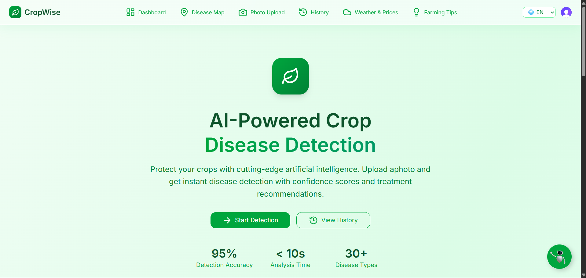

# CropWise Frontend 

CropWise is a web application designed to help farmers and agricultural professionals manage crops efficiently. This repository contains the frontend codebase built with modern web technologies.

**CropWise supports multiple languages, making it accessible to users from diverse regions.**

## Demo

### Video Overview

[![Watch the demo video]](./frontend/public/demovideo.mp4)
> _Click the image above to watch a short demo of CropWise in action._

### App Screenshot


> _A preview of the CropWise dashboard interface._

## Features

- User authentication and profile management
- Dashboard for crop monitoring
- Weather and soil data integration
- Crop health analytics and recommendations
- Responsive and user-friendly interface
- **Multilingual support for a global user base**

## Tech Stack

-  **Framework:** React  
-  **State Management:** useState  
-  **Styling:** CSS/tailwind CSS, ShadCN  
-  **API Communication:** Axios  
-  **Routing:** React Router  
-  **MAP:** leaflet  

## Getting Started

1. **Clone the repository:**
    ```bash
    git clone https://github.com/yourusername/CropWise.git
    cd CropWise/frontend
    ```

2. **Install dependencies:**
    ```bash
    npm install
    ```

3. **Start the development server:**
    ```bash
    npm start
    ```

4. Open [http://localhost:3000](http://localhost:3000) to view the app in your browser.

## Folder Structure

```
frontend/
├── public/
│   ├── logo.png
│   └── app-screenshot.png
├── src/
│   ├── components/
│   ├── pages/
│   ├── redux/
│   ├── utils/
│   └── App.js
├── package.json
└── README.md
```

## Contributing

Contributions are welcome! Please open issues or submit pull requests for improvements.

## License

This project is licensed under the MIT License.

---

# CropWise Backend 

The backend for CropWise powers the core business logic, data storage, and API endpoints for the application. It is designed to be secure, scalable, and easy to maintain.

## Features

- RESTful API for frontend integration
- User authentication and authorization (Clerk)
- Crop, weather, and soil data management
- Analytics and recommendation engine
- Secure data storage

## Tech Stack

-  **Language:** Node.js  
-  **Framework:** Express.js  
-  **Database:** MongoDB  
-  **Authentication:** Clerk  
-  **API Testing:** Postman  

## Getting Started

1. **Clone the repository:**
    ```bash
    git clone https://github.com/yourusername/CropWise.git
    cd CropWise/backend
    ```

2. **Install dependencies:**
    ```bash
    npm install
    ```

3. **Set up environment variables:**
    - Create a `.env` file in the `backend` directory.
    - Add the following variables:
      ```
      PORT=5000
      MONGO_URI=your_mongodb_connection_string
      CLERK_SECRET_KEY=your_clerk_secret_key
      ```

4. **Start the backend server:**
    ```bash
    npm start
    ```

5. The API will be available at [http://localhost:5000](http://localhost:5000).


## Additional Tech Stack

-  **Task Scheduling:** node-cron (for scheduled jobs such as notifications or data sync)
-  **Email Service:** Nodemailer (for sending transactional emails)
-  **SMS Service:** Twilio (for sending SMS alerts and notifications)
-  **Environment Variables:** dotenv (for managing configuration)
-  **API Documentation:** Swagger (for documenting RESTful APIs)
-   **Linting & Formatting:** ESLint, Prettier (for code quality and consistency)


## Folder Structure

```
backend/
├── controllers/
├── models/
├── routes/
├── middleware/
├── utils/
├── app.js
├── package.json
└── README.md
```

## Contributing

Contributions are welcome! Please open issues or submit pull requests for improvements.

## License

This project is licensed under the MIT License.